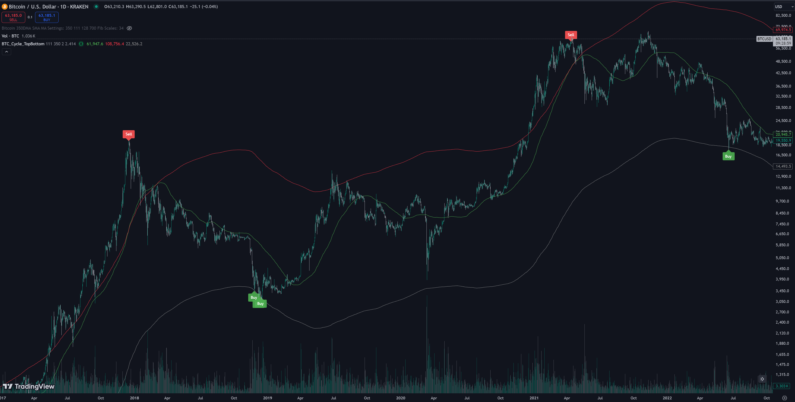

# Bitcoin Cycle Top/Bottom Signal (TradingView)

## Overview

The **Bitcoin Cycle Top/Bottom Signal** indicator for TradingView is specifically designed to identify potential market tops and bottoms for Bitcoin. By utilizing targeted moving averages and Fibonacci ratios, it aids traders in making strategic decisions within Bitcoin's market cycles.

## Installation Instructions

The indicator is not yet listed under "Indicators." To use it:

1. Mark the indicator as a favorite using this [link](https://www.tradingview.com/script/M3EobI8z-Bitcoin-Cycle-Top-Bottom-Signal/).
2. Navigate to a chart and click on "Indicators."
3. Under "Favorites," you will find the indicator to add it to your chart.

## How It Works

This indicator leverages three key components:

- **111-Day Simple Moving Average (SMA1):** Reflects recent Bitcoin price movements.
- **350-Day Simple Moving Average multiplied by 2 (SMA2):** Assists in identifying potential market tops.
- **350-Day Simple Moving Average divided by 2.414 (Fib SMA):** Helps pinpoint potential market bottoms.

### Signals

- **Sell Signal:** Triggered when the 111-day SMA crosses above the 350-day SMA multiplied by 2, indicating a potential market top.
- **Buy Signal:** Occurs when the daily low price crosses below the 350-day SMA divided by 2.414, signaling a potential market bottom.

## Important Notes

- **Daily Chart Only:** This indicator is intended for use exclusively on the Daily timeframe (1D).
- **Limitations:** The indicator cannot predict unforeseen events, such as Black Swan events (e.g., the FTX crash). Without such events, the 2022 Buy Signal would have been accurate.

## Settings

- **Length SMA 1:** Period for SMA1 (default: 111).
- **Length SMA 2:** Period for SMA2 (default: 350).
- **Multiplier for SMA 2:** Multiplier for SMA2 (default: 2.0).
- **Divisor for Fib SMA:** Divisor for Fib SMA (default: 2.414).
